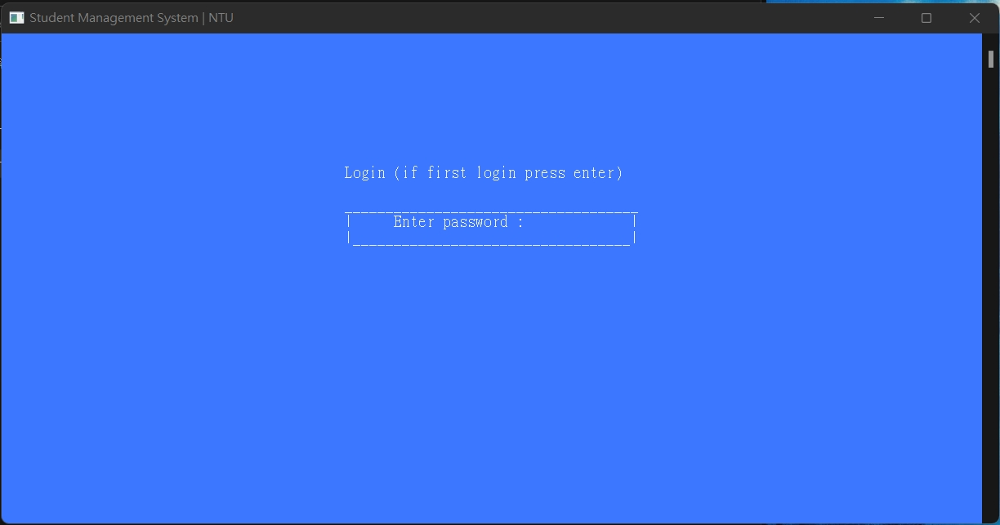
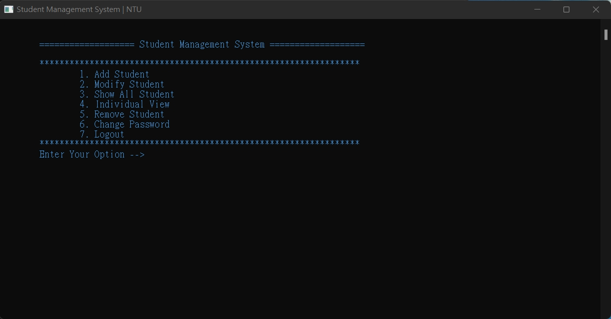
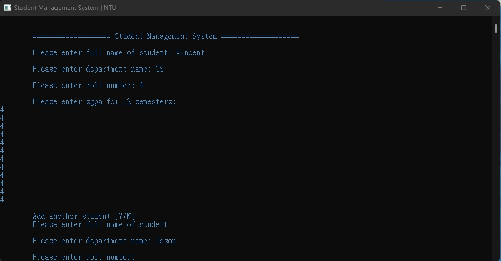
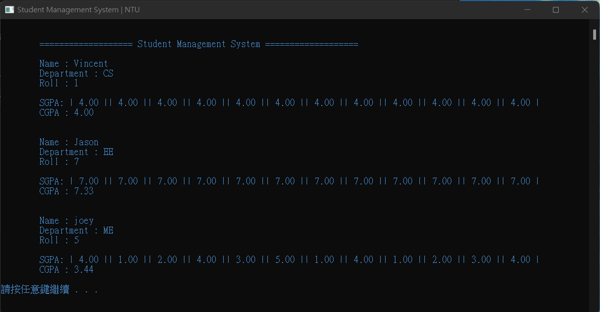

# Student-Management-System in C

This is a simple project using C to manage student, you can add, modify, delete, and show all the data. Also, you can change the password if you want.

### 0x01 Login Page

### 0x02 There are some options you can choose

### 0x03 Adding some new data

### 0x04 Also you can display all the data

